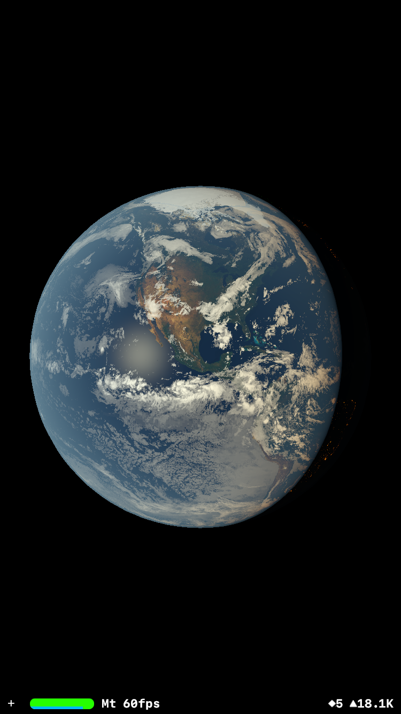
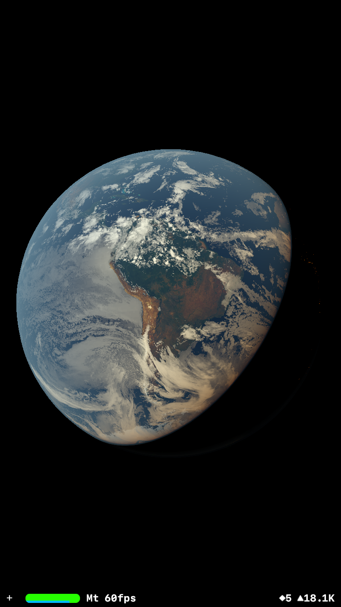
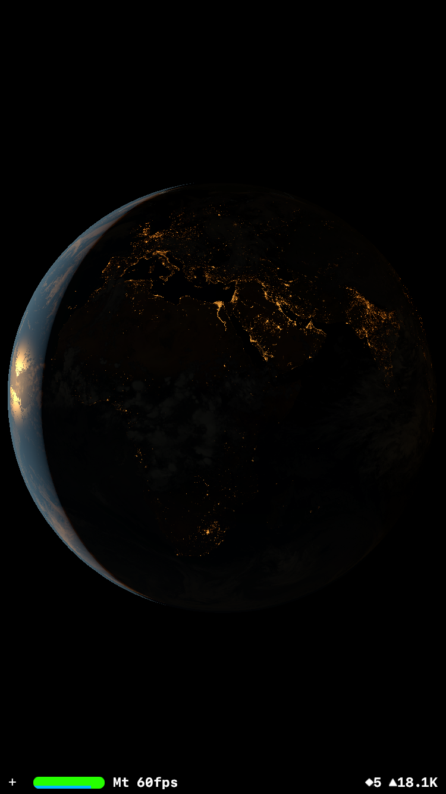
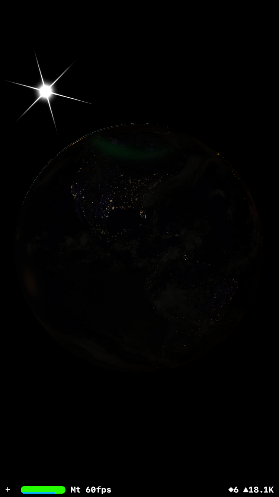
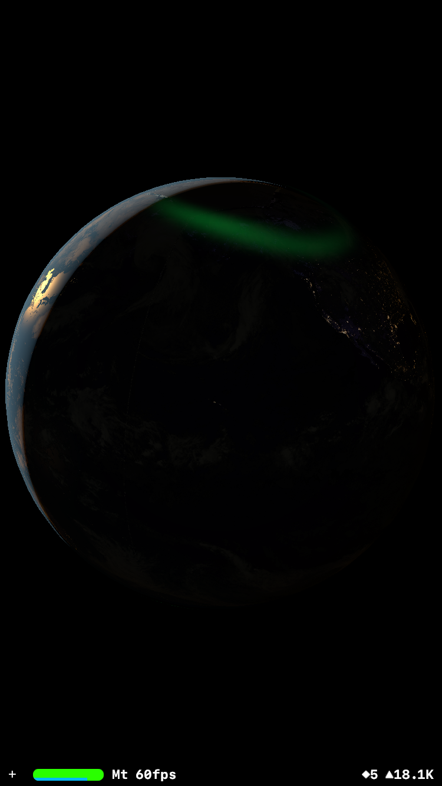

# Earth-App

WIP iOS application showing the Earth right now with clouds and other features.

The goal is to have a representation of the earth as visually accurate as possible, and then adding UI features and possibly weather forecast...

The app includes
- Monthly earth textures with custom shader post-processing
- Night lights with custom shader post-processing
- Custom specular water reflection shader
- Custom atmosphere shader with terminator red light
- Current moon position (including distance from earth)
- The moon casts light on earth
- Current planet inclination and rotation (day/night)
- Current IR clouds covering the entierety of earth, with custom post-processing to make them look more like visible imagery (EUMETSAT data available at : https://navigator.eumetsat.int/product/EO:EUM:DAT:0330?query=Geostationary%20Ring%20IR10.8%20%CE%BCm%20Image%20-%20Multimission&s=advanced)
- Current ongoing auroras (NOAA data available at : https://www.swpc.noaa.gov/products/aurora-30-minute-forecast)

Weak Aurora :

Strong Aurora :

